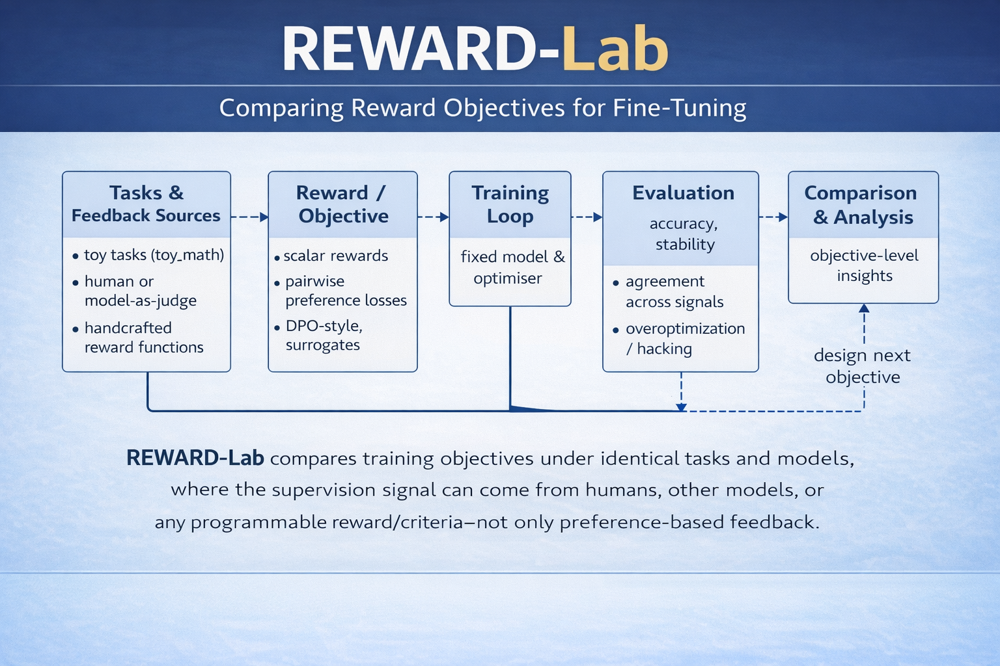

# REWARD-Lab

**Comparing Reward Objectives for Fine-Tuning**

REWARD-Lab is a research toolkit for studying reward and objective design in LLM-based decision-making.

It is designed for controlled experiments where **tasks, models, and optimizers are fixed**, and only the **supervision signal and training objective** are varied.

---

## Motivation

Modern alignment methods often mix:

- task design  
- reward modeling  
- optimization algorithms  
- evaluation metrics  

REWARD-Lab separates these components explicitly to enable:

- objective-level ablations  
- robustness analysis under noisy or uncertain feedback  
- systematic comparison of training losses (scalar, pairwise, DPO-style, surrogate objectives)  

The goal is not to build another RLHF pipeline, but a **laboratory for objective design**.

---

## Architecture Overview

<p align="center">
  
</p>

The framework decomposes training into five independent layers:

### 1. Tasks & Feedback Sources
- Toy environments (e.g., `toy_math`)
- Human feedback
- Model-as-judge
- Handcrafted reward functions

### 2. Judges
Produce a standardized `FeedbackSignal`.

Examples:
- `DataJudge`
- `NoisyJudge` (uncertainty injection)
- Custom rule-based or model-based judges

### 3. Objectives
Convert supervision into a training loss.

Examples:
- `scalar_eval`
- `pairwise_dpo`
- custom surrogate objectives

### 4. Training Loop
Fixed model & optimizer.  
Objectives are swapped without changing the training loop.

### 5. Evaluation & Analysis
- Accuracy  
- Stability  
- Agreement across signals  
- Over-optimization / reward hacking detection  

---

## Design Principles

REWARD-Lab enforces strict separation of concerns:

| Component | Responsibility |
|-----------|---------------|
| Task | Defines data/environment |
| Judge | Produces supervision signal |
| FeedbackSignal | Unified supervision container |
| Objective | Computes loss from supervision |
| Runner | Orchestrates experiment |

New ideas can be added as **plugins** without modifying core code.

---

## Project Structure
```
src/rewardlab/
tasks/
judges/
objectives/
core/
eval/
cli.py
configs/
docs/
```

Modules are selected via YAML configuration.

---

## Example Configuration

```yaml
task:
  name: toy_math
  params: {}

judge:
  name: data_judge
  params:
    field: answer

objective:
  name: scalar_eval
  params: {}

run:
  episodes: 20

```
Switching to a noisy judge:

```yaml
judge:
  name: noisy_judge
  params:
    flip_prob: 0.2
    seed: 0
    base:
      name: data_judge
      params:
        field: answer

```

No changes to the training loop are required.

```
pip install -e .
python -m rewardlab.cli run --config configs/demo.yaml
```


